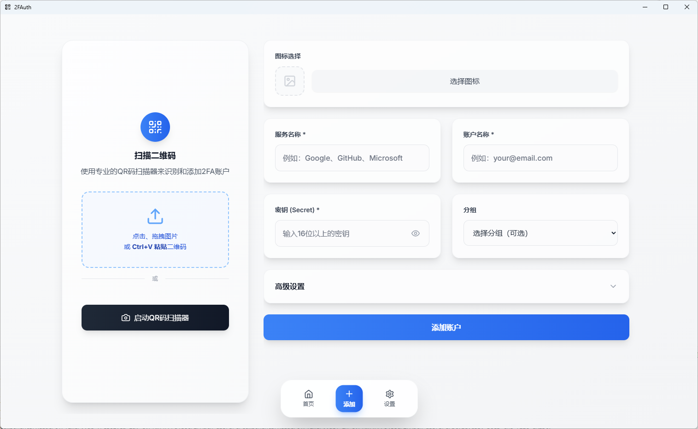
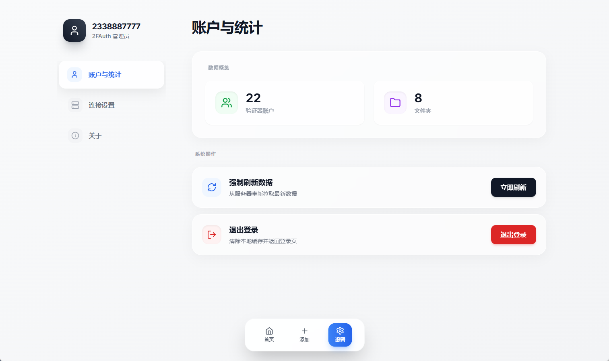

# 2FAuth API 版本客户端

> **重要声明**: 这是一个 2FAuth 的 API 版本客户端，使用官方 API 来连接自托管的 2FAuth。
> 
> **项目状态**: 项目目前基本已完成所有需要用到的功能，已经过测试，请直接到 release 下载。

<div align="center">


一个现代化的移动端2FAuth管理应用，基于Vue3 + Tauri开发，提供完整的双因子认证管理功能

[](https://vuejs.org/)
[](https://tauri.app/)
[](https://vitejs.dev/)
[](https://tailwindcss.com/)
[](https://pinia.vuejs.org/)

[功能特性](#功能特性) • [快速开始](#快速开始) • [下载安装](#下载安装) • [技术架构](#技术架构) • [构建指南](#构建指南)

</div>
<div align="center">
  <h3>Windows 桌面版</h3>
  
  
  

  <h3>Android 移动端</h3>
  
</div>

## 下载安装

### Windows 桌面版下载

你可以从[Releases页面](https://github.com/Nostalgia546/2FAuth-app/releases)下载最新版本的Windows安装包：

1. 访问 [Releases](https://github.com/Nostalgia546/2FAuth-app/releases)
2. 下载最新版本的 `2FAuth_*.*.*_x64-setup.exe` 文件
3. 双击运行安装程序完成安装

### Android APK下载

你可以从[Releases页面](https://github.com/Nostalgia546/2FAuth-app/releases)下载最新版本的APK文件：

1. 访问 [Releases](https://github.com/Nostalgia546/2FAuth-app/releases)
2. 下载最新版本的 `2FAuth-mobile-v*.*.*.apk` 文件
3. 在Android设备上安装APK（需要允许安装未知来源应用）

### 系统要求

- **Windows**: Windows 10/11 64位系统 (需安装 WebView2)
- **Android**: 7.0 (API 24) 及以上版本
- **存储空间**: 至少50MB可用空间
- **网络**: 需要网络连接以访问2FAuth服务器

## 功能特性

### 核心功能

#### 全自动OTP管理
- **智能批量生成**: 应用启动时自动为所有账户并发生成验证码，速度提升3-5倍
- **实时自动更新**: 验证码到期时自动刷新，无需手动操作
- **全局状态管理**: OTP数据全局缓存，页面切换即时显示
- **静默生成**: 后台自动处理，不打扰用户操作

#### 智能界面交互
- **一键复制**: 点击整个账户卡片即可复制验证码
- **固定顶栏**: 滚动时顶部导航始终可见
- **触摸反馈**: 专为移动端优化的交互动画
- **智能图标**: 优先显示真实账户图标，自动回退到彩色首字母

### 移动端优化

#### 响应式设计
- **原生级体验**: 专为移动设备设计的界面布局
- **触摸友好**: 大按钮、易点击的交互区域
- **手势支持**: 支持下拉刷新、侧滑导航等移动端手势
- **适配完美**: 支持各种屏幕尺寸和分辨率

#### 性能优化
- **并发请求**: 批量API调用，减少网络延迟
- **智能缓存**: 避免重复请求，提升响应速度
- **懒加载**: 按需加载组件和资源
- **内存优化**: 高效的状态管理和垃圾回收

### 安全特性

#### 数据保护
- **安全存储**: API密钥本地加密存储
- **Bearer认证**: 标准OAuth2.0认证流程
- **HTTPS传输**: 所有数据加密传输
- **会话管理**: 自动登出和会话过期处理

#### 隐私保护
- **本地处理**: 验证码仅在内存中处理，不持久化
- **权限最小化**: 仅请求必要的系统权限
- **透明操作**: 所有网络请求都有明确的用途说明

### 用户体验

#### 现代化界面
- **Material Design**: 遵循现代设计原则
- **深色模式**: 支持系统主题切换
- **流畅动画**: 自然的过渡效果和微交互
- **直观导航**: 清晰的信息架构和导航结构

#### 智能功能
- **搜索筛选**: 快速查找特定账户
- **分组管理**: 按服务类型或用途分组
- **批量操作**: 支持多选和批量管理
- **自动备份**: 数据导入导出功能

## 技术架构

### 前端技术栈

```
Vue 3.4+          现代化响应式框架
├── Composition API   组合式API，更好的逻辑复用
├── TypeScript       类型安全，减少运行时错误
└── Vue Router 4     单页面应用路由管理

Tauri 2.0+        跨平台应用框架
├── Rust Backend     高性能后端处理
├── Mobile Support   原生移动端支持
└── Security         内置安全机制

Vite 4.5+         极速构建工具
├── HMR              热模块替换，开发体验优异
├── Tree Shaking     按需打包，减小体积
└── Plugin System    丰富的插件生态

Pinia 2.1+        状态管理
├── TypeScript       完整类型支持
├── DevTools         开发者工具集成
└── SSR Support      服务端渲染支持

Tailwind CSS 3.3+ 原子化CSS框架
├── JIT Mode         即时编译，按需生成
├── Dark Mode        深色模式支持
└── Mobile First     移动端优先设计
```

### 项目结构

```
src/
├── components/          可复用组件
│   ├── AccountIcon.vue     智能图标组件
│   └── ...
├── views/              页面组件
│   ├── Dashboard.vue      主控制面板
│   ├── Accounts.vue       账户管理
│   ├── Login.vue          用户登录
│   ├── Settings.vue       系统设置
│   └── ...
├── stores/             状态管理
│   ├── auth.js            认证管理
│   ├── accounts.js        账户和OTP管理
│   ├── app.js             全局状态
│   └── ...
├── router/             路由配置
├── utils/              工具函数
│   ├── api.js             API客户端
│   └── ...
└── assets/             静态资源

src-tauri/              Tauri后端
├── src/                Rust源码
├── gen/android/        Android项目
├── icons/              应用图标
└── tauri.conf.json     Tauri配置
```

### 核心架构设计

#### 全局OTP管理系统
```javascript
// 高性能并发OTP生成
const generateAllOTPs = async (accountIds = null) => {
  const otpPromises = targetAccounts.map(async (accountId) => {
    return await generateOTP(accountId) // 并发执行
  })
  return await Promise.all(otpPromises) // 等待所有完成
}

// 智能自动更新机制
const startOTPTimer = () => {
  setInterval(async () => {
    updateOTPTimers()           // 更新倒计时
    await refreshExpiredOTPs()  // 刷新过期OTP
  }, 1000)
}
```

#### 响应式状态管理
```javascript
// Pinia Store with TypeScript
export const useAccountsStore = defineStore('accounts', () => {
  const accounts = ref([])
  const otpData = ref({})
  const isGeneratingOTP = ref(false)
  
  // 计算属性自动更新UI
  const filteredAccounts = computed(() => {
    return accounts.value.filter(/* 筛选逻辑 */)
  })
  
  return { accounts, otpData, filteredAccounts }
})
```

## 快速开始

### 环境要求

- **Node.js**: >= 18.0.0
- **npm**: >= 9.0.0 或 **yarn**: >= 1.22.0
- **2FAuth服务器**: >= 1.7.0
- **Rust**: >= 1.70.0 (用于构建)

### 安装步骤

1. **克隆项目**
   ```bash
   git clone https://github.com/Nostalgia546/2FAuth-app.git
   cd 2FAuth-app
   ```

2. **安装依赖**
   ```bash
   npm install
   # 或使用 yarn
   yarn install
   ```

3. **启动开发服务器**
   ```bash
   npm run dev
   # 或使用 yarn
   yarn dev
   ```

## 构建指南

### Web版本构建

```bash
# 构建Web版本
npm run build
# 或
yarn build
```

### Android APK构建

#### 环境准备

1. **安装Android Studio和SDK**
   - 下载并安装 [Android Studio](https://developer.android.com/studio)
   - 安装Android SDK (推荐API 34+)
   - 安装Android NDK

2. **配置环境变量**
   ```bash
   # Windows
   set ANDROID_HOME=C:\Users\你的用户名\AppData\Local\Android\Sdk
   set NDK_HOME=%ANDROID_HOME%\ndk\版本号
   
   # Linux/macOS
   export ANDROID_HOME=$HOME/Android/Sdk
   export NDK_HOME=$ANDROID_HOME/ndk/版本号
   ```

3. **安装Rust移动端目标**
   ```bash
   rustup target add aarch64-linux-android armv7-linux-androideabi i686-linux-android x86_64-linux-android
   ```

#### 构建步骤

1. **初始化Android项目**
   ```bash
   npx tauri android init
   ```

2. **构建APK**
   ```bash
   # 构建调试版APK
   npx tauri android build
   
   # 构建发布版APK
   npx tauri android build --apk
   ```

3. **生成的文件位置**
   ```
   src-tauri/gen/android/app/build/outputs/apk/
   ├── debug/
   │   └── app-debug.apk
   └── release/
       └── app-release.apk
   ```

### 桌面版构建

```bash
# 构建当前平台的桌面应用
npx tauri build

# 构建特定平台
npx tauri build --target x86_64-pc-windows-msvc  # Windows
npx tauri build --target x86_64-apple-darwin     # macOS
npx tauri build --target x86_64-unknown-linux-gnu # Linux
```

## 贡献指南

欢迎提交Issue和Pull Request！

1. Fork 这个项目
2. 创建你的特性分支 (`git checkout -b feature/AmazingFeature`)
3. 提交你的修改 (`git commit -m 'Add some AmazingFeature'`)
4. 推送到分支 (`git push origin feature/AmazingFeature`)
5. 打开一个Pull Request

## 许可证

本项目采用 MIT 许可证 - 查看 [LICENSE](LICENSE) 文件了解详情。

## 致谢

- [2FAuth](https://github.com/Bubka/2FAuth) - 优秀的2FA管理系统
- [Vue.js](https://vuejs.org/) - 渐进式JavaScript框架
- [Tauri](https://tauri.app/) - 构建跨平台应用的框架
- [Tailwind CSS](https://tailwindcss.com/) - 实用优先的CSS框架

---


如果这个项目对你有帮助，请给个 star 支持一下！

